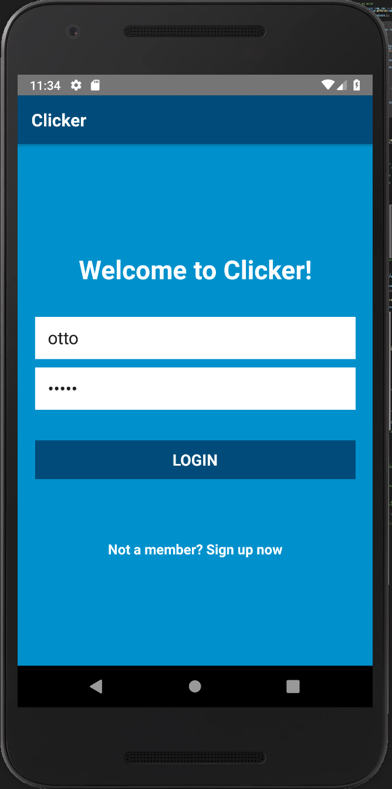
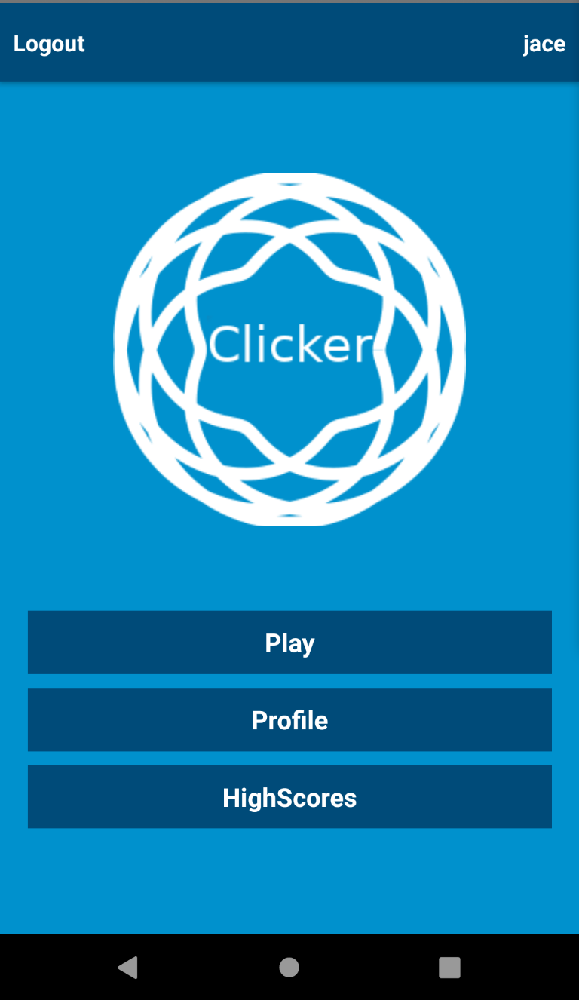
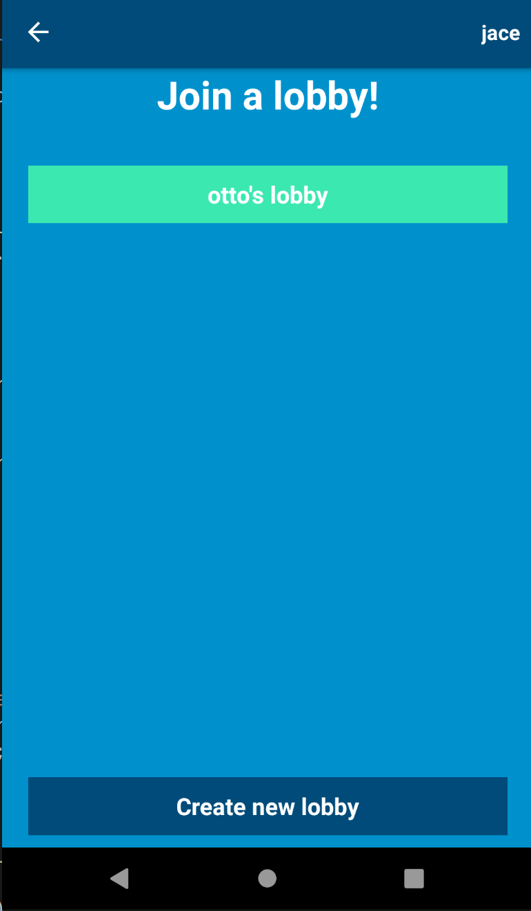
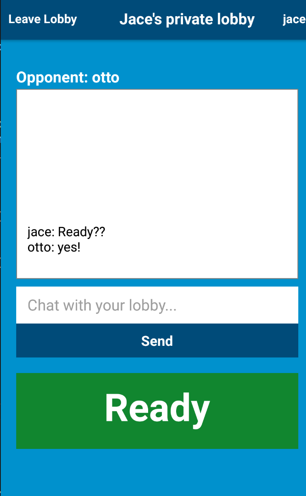
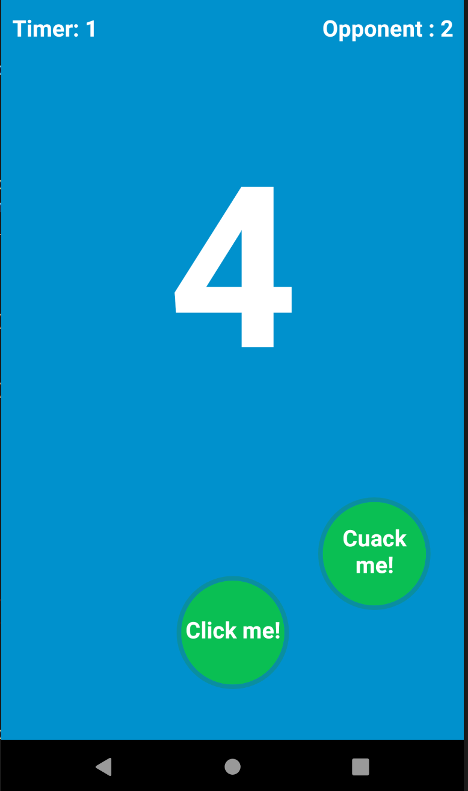
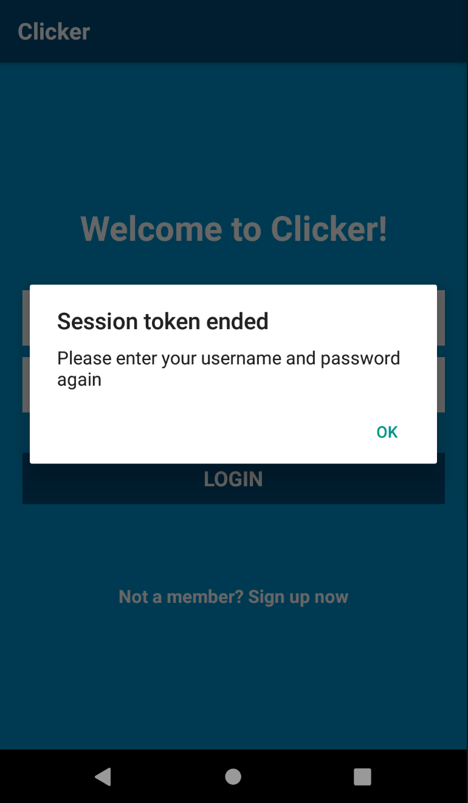
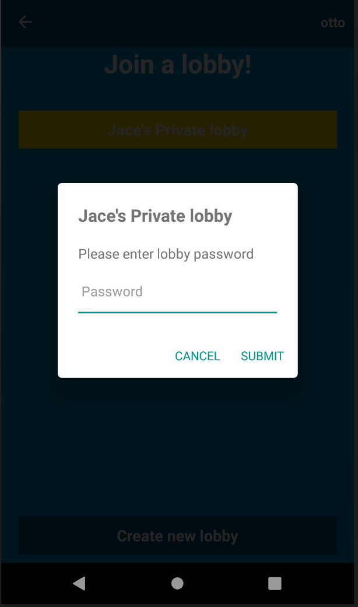
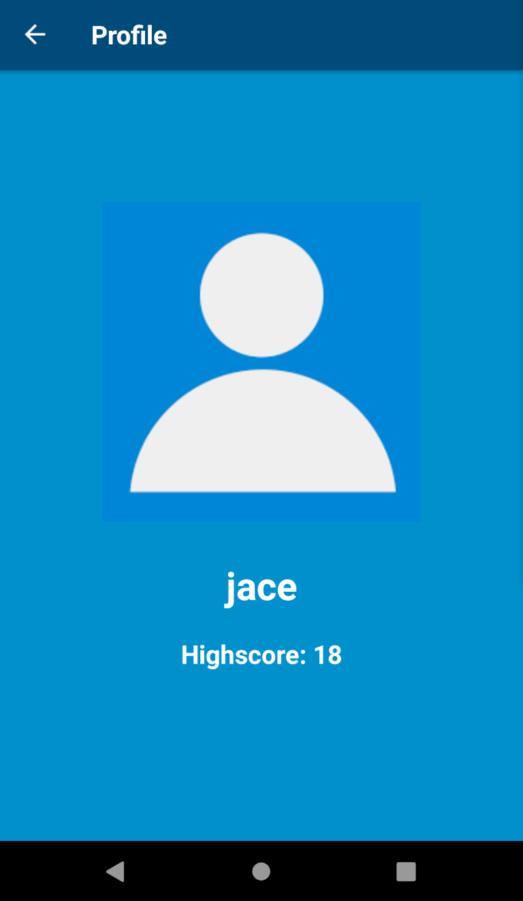

# Clicker-Game
React native mobile game using websockets.

Home Screen      |  Menu | Lobby list
:-------------------------:|:-------------------------:|:-------------------------:
  |   | 
**Game lobby with chatt**      |  **The game** | **Token is needed to verify user**
 |  | 
**Private and public lobbys**      |  **Highscore List** | **Profile**
 |  | 
